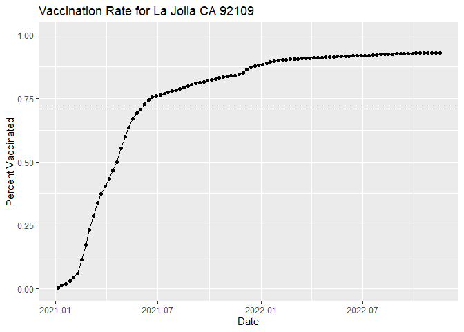

Covid-19 Vaccination Rate
================
Jinsung Park

# Covid-19 Vaccination Rates

Download the Statewide COVID-19 Vaccines csv file.

Limitations of the data:

Data don’t include doses administered by the following federal agencies
who received vaccine allocated directly from CDC: Indian Health Service,
Veterans Health Administration, Department of Defense, and the Federal
Bureau of Prisons. Zip code areas that include military bases will
likely show artificially low vaccination rates

## Reading the file

``` r
vax <- read.csv("Statewide COVID-19 Vaccines.csv")
head(vax)
```

      as_of_date zip_code_tabulation_area local_health_jurisdiction          county
    1 2021-01-05                    93562            San Bernardino  San Bernardino
    2 2021-01-05                    93437             Santa Barbara   Santa Barbara
    3 2021-01-05                    93445           San Luis Obispo San Luis Obispo
    4 2021-01-05                    93442           San Luis Obispo San Luis Obispo
    5 2021-01-05                    93444           San Luis Obispo San Luis Obispo
    6 2021-01-05                    93453           San Luis Obispo San Luis Obispo
      vaccine_equity_metric_quartile                 vem_source
    1                              1 Healthy Places Index Score
    2                             NA            No VEM Assigned
    3                              2 Healthy Places Index Score
    4                              3 Healthy Places Index Score
    5                              3 Healthy Places Index Score
    6                              3 Healthy Places Index Score
      age12_plus_population age5_plus_population tot_population
    1                1469.5                 1668           1771
    2                2494.5                 2871           3387
    3                6116.7                 6762           7106
    4               10005.2                10615          10917
    5               18951.8                20522          21331
    6                2373.6                 2499           2578
      persons_fully_vaccinated persons_partially_vaccinated
    1                       NA                           NA
    2                       NA                           NA
    3                       NA                           NA
    4                       NA                           NA
    5                       NA                           NA
    6                       NA                           NA
      percent_of_population_fully_vaccinated
    1                                     NA
    2                                     NA
    3                                     NA
    4                                     NA
    5                                     NA
    6                                     NA
      percent_of_population_partially_vaccinated
    1                                         NA
    2                                         NA
    3                                         NA
    4                                         NA
    5                                         NA
    6                                         NA
      percent_of_population_with_1_plus_dose booster_recip_count
    1                                     NA                  NA
    2                                     NA                  NA
    3                                     NA                  NA
    4                                     NA                  NA
    5                                     NA                  NA
    6                                     NA                  NA
      bivalent_dose_recip_count eligible_recipient_count
    1                        NA                        0
    2                        NA                        1
    3                        NA                        0
    4                        NA                        1
    5                        NA                        0
    6                        NA                        0
                                                                   redacted
    1 Information redacted in accordance with CA state privacy requirements
    2 Information redacted in accordance with CA state privacy requirements
    3 Information redacted in accordance with CA state privacy requirements
    4 Information redacted in accordance with CA state privacy requirements
    5 Information redacted in accordance with CA state privacy requirements
    6 Information redacted in accordance with CA state privacy requirements

> Q1. What column details the total number of people fully vaccinated?

Column ‘tot_population’ shows the total number of people fully
vaccinated in each area.

> Q2. What column details the Zip code tabulation area?

Column ‘zip_code_tabulation_area’ contains zip code of each area.

> Q3. What is the earliest date in this dataset?

``` r
min(vax$as_of_date)
```

    [1] "2021-01-05"

The earliest date in the dataset is Jan 05, 2021.

> Q4. What is the latest date in this dataset?

``` r
max(vax$as_of_date)
```

    [1] "2022-11-15"

The latest data in the dataset is Nov 15, 2022.

Let’s use ‘skim()’ function from the skimr package to get a quick
overview

``` r
skimr::skim(vax)
```

|                                                  |        |
|:-------------------------------------------------|:-------|
| Name                                             | vax    |
| Number of rows                                   | 172872 |
| Number of columns                                | 18     |
| \_\_\_\_\_\_\_\_\_\_\_\_\_\_\_\_\_\_\_\_\_\_\_   |        |
| Column type frequency:                           |        |
| character                                        | 5      |
| numeric                                          | 13     |
| \_\_\_\_\_\_\_\_\_\_\_\_\_\_\_\_\_\_\_\_\_\_\_\_ |        |
| Group variables                                  | None   |

Data summary

**Variable type: character**

| skim_variable             | n_missing | complete_rate | min | max | empty | n_unique | whitespace |
|:--------------------------|----------:|--------------:|----:|----:|------:|---------:|-----------:|
| as_of_date                |         0 |             1 |  10 |  10 |     0 |       98 |          0 |
| local_health_jurisdiction |         0 |             1 |   0 |  15 |   490 |       62 |          0 |
| county                    |         0 |             1 |   0 |  15 |   490 |       59 |          0 |
| vem_source                |         0 |             1 |  15 |  26 |     0 |        3 |          0 |
| redacted                  |         0 |             1 |   2 |  69 |     0 |        2 |          0 |

**Variable type: numeric**

| skim_variable                              | n_missing | complete_rate |     mean |       sd |    p0 |      p25 |      p50 |      p75 |     p100 | hist  |
|:-------------------------------------------|----------:|--------------:|---------:|---------:|------:|---------:|---------:|---------:|---------:|:------|
| zip_code_tabulation_area                   |         0 |          1.00 | 93665.11 |  1817.39 | 90001 | 92257.75 | 93658.50 | 95380.50 |  97635.0 | ▃▅▅▇▁ |
| vaccine_equity_metric_quartile             |      8526 |          0.95 |     2.44 |     1.11 |     1 |     1.00 |     2.00 |     3.00 |      4.0 | ▇▇▁▇▇ |
| age12_plus_population                      |         0 |          1.00 | 18895.04 | 18993.88 |     0 |  1346.95 | 13685.10 | 31756.12 |  88556.7 | ▇▃▂▁▁ |
| age5_plus_population                       |         0 |          1.00 | 20875.24 | 21105.98 |     0 |  1460.50 | 15364.00 | 34877.00 | 101902.0 | ▇▃▂▁▁ |
| tot_population                             |      8428 |          0.95 | 23372.77 | 22628.51 |    12 |  2126.00 | 18714.00 | 38168.00 | 111165.0 | ▇▅▂▁▁ |
| persons_fully_vaccinated                   |     15440 |          0.91 | 13309.15 | 14740.07 |    11 |   859.00 |  7687.00 | 22253.00 |  87305.0 | ▇▃▁▁▁ |
| persons_partially_vaccinated               |     15440 |          0.91 |  1679.13 |  1993.86 |    11 |   157.00 |  1158.00 |  2483.00 |  39201.0 | ▇▁▁▁▁ |
| percent_of_population_fully_vaccinated     |     18986 |          0.89 |     0.54 |     0.26 |     0 |     0.36 |     0.58 |     0.73 |      1.0 | ▃▃▆▇▃ |
| percent_of_population_partially_vaccinated |     18986 |          0.89 |     0.08 |     0.09 |     0 |     0.05 |     0.06 |     0.08 |      1.0 | ▇▁▁▁▁ |
| percent_of_population_with_1\_plus_dose    |     19822 |          0.89 |     0.60 |     0.26 |     0 |     0.42 |     0.64 |     0.79 |      1.0 | ▂▃▆▇▆ |
| booster_recip_count                        |     70642 |          0.59 |  5701.06 |  6972.68 |    11 |   276.00 |  2546.00 |  9513.00 |  58301.0 | ▇▂▁▁▁ |
| bivalent_dose_recip_count                  |    156937 |          0.09 |  1512.94 |  1994.71 |    11 |   101.00 |   662.00 |  2236.00 |  16790.0 | ▇▁▁▁▁ |
| eligible_recipient_count                   |         0 |          1.00 | 12114.80 | 14551.97 |     0 |   438.00 |  5520.00 | 20714.00 |  86817.0 | ▇▂▁▁▁ |

> Q5. How many numeric columns are in this dataset?

There are 13 numeric columns in the dataset.

> Q6. Note that there are “missing values” in the dataset. How many NA
> values there in the persons_fully_vaccinated column?

‘persons_fully_vaccinated’ column contains 15440 NA values

> Q7. What percent of persons_fully_vaccinated values are missing (to 2
> significant figures)?

89% of ‘persons_fully_vaccinated’ are missing

> Q8. \[Optional\]: Why might this data be missing?

This data might be missing due to lack of vaccination record performed
by federal agency.

## Working with Dates

‘as_of_date’ column contains dates in the Year-Month-Day format.

‘lubridate’ package can make life allot easier when dealing with date
format.

``` r
library(lubridate)
```

    Loading required package: timechange


    Attaching package: 'lubridate'

    The following objects are masked from 'package:base':

        date, intersect, setdiff, union

``` r
today()
```

    [1] "2022-12-01"

This is cool!

By using ‘lubridate’ we can turn ‘as_of_date’ column into the usable
form. We need to provide argument first to allow us to do math with
date.

``` r
vax$as_of_date <- ymd(vax$as_of_date)
```

``` r
today() - vax$as_of_date[1]
```

    Time difference of 695 days

> Q9. How many days have passed since the last update of the dataset?

``` r
today()-max(vax$as_of_date)
```

    Time difference of 16 days

It has been 7 days since the last update of the dataset.

> Q10. How many unique dates are in the dataset (i.e. how many different
> dates are detailed)?

``` r
nrow(table(vax$as_of_date))
```

    [1] 98

There are 98 different dates in the dataset.

## Working with Zipcode

We can use the ‘zipcodeR’ package to make working with these codes
easier.

## Focus on San Diego Area

We can focus by restricting ourselves first to vax\$county == “San
Diego”

``` r
library(dplyr)
```


    Attaching package: 'dplyr'

    The following objects are masked from 'package:stats':

        filter, lag

    The following objects are masked from 'package:base':

        intersect, setdiff, setequal, union

``` r
sd <- filter(vax, county == "San Diego")

nrow(sd)
```

    [1] 10486

Using dplyr also allow us to subset across multiple criteria

``` r
sd.10 <- filter(vax, county == "San Diego" &
                age5_plus_population > 10000)
```

> Q11. How many distinct zip codes are listed for San Diego County?

``` r
nrow(table(sd$zip_code_tabulation_area))
```

    [1] 107

There are 107 distinct zip codes listed for San Diego County.

> Q12. What San Diego County Zip code area has the largest 12 +
> Population in this dataset?

``` r
which.max(sd$age12_plus_population)
```

    [1] 90

``` r
sd[90,2]
```

    [1] 92154

Zip code with the largest 12+ population value is 92154.

> Q13. What is the overall average “Percent of Population Fully
> Vaccinated” value for all San Diego “County” as of “2022-11-15”?

``` r
library(dplyr)
sd1115 <- filter(vax, county == "San Diego" & as_of_date == "2022-11-15")
nrow(sd1115)
```

    [1] 107

``` r
sd1115_mean <- mean(sd1115$percent_of_population_fully_vaccinated, na.rm = TRUE)
sd1115_mean
```

    [1] 0.7381765

Average of fully vaccinated population percentage is 0.738

> Q14. Using either ggplot or base R graphics make a summary figure that
> shows the distribution of Percent of Population Fully Vaccinated
> values as of “2022-11-15”?

``` r
library(ggplot2)
df <- sd1115
p <- ggplot(df, aes(x = percent_of_population_fully_vaccinated)) + geom_histogram(color = "black", fill="white")
p
```

    `stat_bin()` using `bins = 30`. Pick better value with `binwidth`.

    Warning: Removed 8 rows containing non-finite values (stat_bin).


## Focus on UCSD/La Jolla

UC San Diego resides in the 92037 ZIP code area and is listed with an
age 5+ population size of 36,144.

``` r
ucsd <- filter(sd, zip_code_tabulation_area=="92037")
ucsd[1,]$age5_plus_population
```

    [1] 36144

> Q15. Using ggplot make a graph of the vaccination rate time course for
> the 92037 ZIP code area:

``` r
p <- ggplot(ucsd) +
  aes(x = as_of_date,y = percent_of_population_fully_vaccinated) + geom_point() + geom_line(group=1) + ylim(c(0,1)) +
  labs(x = "Date", y = "Percent Vaccinated")
p
```


## Comparing to similar sized areas

Let’s return to the full dataset and look across every zip code area
with a population at least as large as that of 92037 on as_of_date
“2022-02-22”.

``` r
vax.36 <- filter(vax, age5_plus_population > 36144 &
                as_of_date == "2022-11-15")

head(vax.36)
```

      as_of_date zip_code_tabulation_area local_health_jurisdiction       county
    1 2022-11-15                    92127                 San Diego    San Diego
    2 2022-11-15                    92201                 Riverside    Riverside
    3 2022-11-15                    92111                 San Diego    San Diego
    4 2022-11-15                    92122                 San Diego    San Diego
    5 2022-11-15                    92129                 San Diego    San Diego
    6 2022-11-15                    94561              Contra Costa Contra Costa
      vaccine_equity_metric_quartile                 vem_source
    1                              4 Healthy Places Index Score
    2                              1 Healthy Places Index Score
    3                              3 Healthy Places Index Score
    4                              4 Healthy Places Index Score
    5                              4 Healthy Places Index Score
    6                              3 Healthy Places Index Score
      age12_plus_population age5_plus_population tot_population
    1               38942.3                46080          49935
    2               55960.9                61733          65726
    3               44075.0                48160          50693
    4               44091.1                45951          48071
    5               46449.1                51493          54762
    6               34548.9                39272          42473
      persons_fully_vaccinated persons_partially_vaccinated
    1                    41150                         3362
    2                    44078                         7311
    3                    34968                         3524
    4                    37846                         5167
    5                    43573                         3337
    6                    32347                         1804
      percent_of_population_fully_vaccinated
    1                               0.824071
    2                               0.670633
    3                               0.689799
    4                               0.787294
    5                               0.795679
    6                               0.761590
      percent_of_population_partially_vaccinated
    1                                   0.067328
    2                                   0.111235
    3                                   0.069517
    4                                   0.107487
    5                                   0.060936
    6                                   0.042474
      percent_of_population_with_1_plus_dose booster_recip_count
    1                               0.891399               27742
    2                               0.781868               21043
    3                               0.759316               21623
    4                               0.894781               26519
    5                               0.856615               29989
    6                               0.804064               18909
      bivalent_dose_recip_count eligible_recipient_count redacted
    1                      7809                    40694       No
    2                      3965                    43955       No
    3                      5715                    34693       No
    4                      8646                    37523       No
    5                      8783                    43106       No
    6                      4323                    32167       No

> Q16. Calculate the mean “Percent of Population Fully Vaccinated” for
> ZIP code areas with a population as large as 92037 (La Jolla)
> as_of_date “2022-11-15”. Add this as a straight horizontal line to
> your plot from above with the geom_hline() function?

``` r
vax_mean <- mean(vax.36$percent_of_population_fully_vaccinated, na.rm = TRUE)
vax_mean
```

    [1] 0.7088141

``` r
p2 <- ggplot(ucsd) +
  aes(x = as_of_date,y = percent_of_population_fully_vaccinated) + geom_point() + geom_line(group=1) + ylim(c(0,1)) + ggtitle("Vaccination Rate for La Jolla CA 92109") + geom_hline(yintercept = vax_mean, linetype="dashed", color = "red") +
  labs(x = "Date", y = "Percent Vaccinated")
p2
```



> Q17. What is the 6 number summary (Min, 1st Qu., Median, Mean, 3rd
> Qu., and Max) of the “Percent of Population Fully Vaccinated” values
> for ZIP code areas with a population as large as 92037 (La Jolla)
> as_of_date “2022-11-15”?

``` r
summary(vax.36$percent_of_population_fully_vaccinated)
```

       Min. 1st Qu.  Median    Mean 3rd Qu.    Max. 
     0.1986  0.6338  0.7162  0.7088  0.7893  1.0000 

> Q18. Using ggplot generate a histogram of this data.

``` r
df <- vax.36
p3 <- ggplot(df, aes(x = percent_of_population_fully_vaccinated)) + geom_histogram(color = "black", fill="white")
p3
```

    `stat_bin()` using `bins = 30`. Pick better value with `binwidth`.


> Q19. Is the 92109 and 92040 ZIP code areas above or below the average
> value you calculated for all these above?

``` r
vax %>% filter(as_of_date == "2022-11-15") %>%  
  filter(zip_code_tabulation_area=="92040") %>%
  select(percent_of_population_fully_vaccinated)
```

      percent_of_population_fully_vaccinated
    1                               0.547251

``` r
vax %>% filter(as_of_date == "2022-11-15") %>%  
  filter(zip_code_tabulation_area=="92109") %>%
  select(percent_of_population_fully_vaccinated)
```

      percent_of_population_fully_vaccinated
    1                               0.695676

Both area 92040 and 92109 are below the average for fully vaccinated
population percentages for ZIP code areas with a population as large as
92037 (La Jolla) as_of_date “2022-11-15”.

> Q20. Finally make a time course plot of vaccination progress for all
> areas in the full dataset with a age5_plus_population \> 36144.

``` r
vax.36.all <- filter(vax,age5_plus_population > 36144)

ggplot(vax.36.all) +
  aes(as_of_date,
      percent_of_population_fully_vaccinated, 
      group=zip_code_tabulation_area) +
  geom_line(alpha=0.2, color="blue") +
  ylim(c(0,1)) +
  labs(x = "Date", y = "Percent Vaccinated",
       title="Vaccination Rate Across California",
       subtitle="Only Areas with a Popuplation Above 36k are Shown") +
  geom_hline(yintercept = vax_mean, linetype="dashed", color = "red")
```

    Warning: Removed 183 row(s) containing missing values (geom_path).


> Q21. How do you feel about traveling for Thanksgiving Break and
> meeting for in-person class afterwards?

Pretty safe, as about more than half of the areas seem to be vaccinated
above the average.
