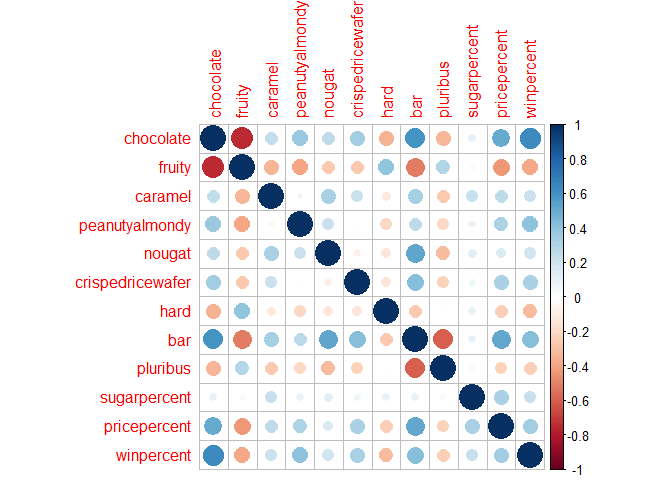

HalloweenMiniProject
================
Jinsung

<script src="HalloweenMiniProject_files/libs/htmlwidgets-1.5.4/htmlwidgets.js"></script>
<script src="HalloweenMiniProject_files/libs/plotly-binding-4.10.0/plotly.js"></script>
<script src="HalloweenMiniProject_files/libs/typedarray-0.1/typedarray.min.js"></script>
<script src="HalloweenMiniProject_files/libs/jquery-3.5.1/jquery.min.js"></script>
<link href="HalloweenMiniProject_files/libs/crosstalk-1.2.0/css/crosstalk.min.css" rel="stylesheet" />
<script src="HalloweenMiniProject_files/libs/crosstalk-1.2.0/js/crosstalk.min.js"></script>
<link href="HalloweenMiniProject_files/libs/plotly-htmlwidgets-css-2.5.1/plotly-htmlwidgets.css" rel="stylesheet" />
<script src="HalloweenMiniProject_files/libs/plotly-main-2.5.1/plotly-latest.min.js"></script>


# Halloweeen Mini Project

## Data Implication

First, read the data off from Github pro. Load it with ‘read.csv()’ and
inspect.

``` r
candy_file <- "candy-data.txt"
candy <- read.csv(candy_file, row.names=1)
head(candy)
```

                 chocolate fruity caramel peanutyalmondy nougat crispedricewafer
    100 Grand            1      0       1              0      0                1
    3 Musketeers         1      0       0              0      1                0
    One dime             0      0       0              0      0                0
    One quarter          0      0       0              0      0                0
    Air Heads            0      1       0              0      0                0
    Almond Joy           1      0       0              1      0                0
                 hard bar pluribus sugarpercent pricepercent winpercent
    100 Grand       0   1        0        0.732        0.860   66.97173
    3 Musketeers    0   1        0        0.604        0.511   67.60294
    One dime        0   0        0        0.011        0.116   32.26109
    One quarter     0   0        0        0.011        0.511   46.11650
    Air Heads       0   0        0        0.906        0.511   52.34146
    Almond Joy      0   1        0        0.465        0.767   50.34755

> Q1. How many different candy types are in this dataset?

``` r
ncol(candy)
```

    [1] 12

There are 12 different types of candies in the dataset.

> Q2. How many fruity candy types are in the dataset?

``` r
sum(candy$fruity)
```

    [1] 38

There are 38 fruity candy types in the dataset.

## Favorite Candy

Winpercent is percentage of people who prefer this over others.
Winpercent of the particular candy can be found in the dataset. For
example, Twix’s win% would be:

``` r
candy["Twix", ]$winpercent
```

    [1] 81.64291

> Q3. What is your favorite candy in the dataset and what is it’s
> winpercent value?

``` r
candy["Kit Kat",]$winpercent
```

    [1] 76.7686

Win% of Kit Kat is 76.7686%.

> Q4. What is the winpercent value for “Kit Kat”?

As stated above, my favorite candy, Kit Kat, has win% value of 76.7686.

> Q5. What is the winpercent value for “Tootsie Roll Snack Bars”?

``` r
candy["Tootsie Roll Snack Bars",]$winpercent
```

    [1] 49.6535

Tootsie Rol Snack Bars has win% of 49.6535. Not so popular one is it?

‘skim()’ function is useful for having overview of the dataset.

``` r
library("skimr")
skim(candy)
```

|                                                  |       |
|:-------------------------------------------------|:------|
| Name                                             | candy |
| Number of rows                                   | 85    |
| Number of columns                                | 12    |
| \_\_\_\_\_\_\_\_\_\_\_\_\_\_\_\_\_\_\_\_\_\_\_   |       |
| Column type frequency:                           |       |
| numeric                                          | 12    |
| \_\_\_\_\_\_\_\_\_\_\_\_\_\_\_\_\_\_\_\_\_\_\_\_ |       |
| Group variables                                  | None  |

Data summary

**Variable type: numeric**

| skim_variable    | n_missing | complete_rate |  mean |    sd |    p0 |   p25 |   p50 |   p75 |  p100 | hist  |
|:-----------------|----------:|--------------:|------:|------:|------:|------:|------:|------:|------:|:------|
| chocolate        |         0 |             1 |  0.44 |  0.50 |  0.00 |  0.00 |  0.00 |  1.00 |  1.00 | ▇▁▁▁▆ |
| fruity           |         0 |             1 |  0.45 |  0.50 |  0.00 |  0.00 |  0.00 |  1.00 |  1.00 | ▇▁▁▁▆ |
| caramel          |         0 |             1 |  0.16 |  0.37 |  0.00 |  0.00 |  0.00 |  0.00 |  1.00 | ▇▁▁▁▂ |
| peanutyalmondy   |         0 |             1 |  0.16 |  0.37 |  0.00 |  0.00 |  0.00 |  0.00 |  1.00 | ▇▁▁▁▂ |
| nougat           |         0 |             1 |  0.08 |  0.28 |  0.00 |  0.00 |  0.00 |  0.00 |  1.00 | ▇▁▁▁▁ |
| crispedricewafer |         0 |             1 |  0.08 |  0.28 |  0.00 |  0.00 |  0.00 |  0.00 |  1.00 | ▇▁▁▁▁ |
| hard             |         0 |             1 |  0.18 |  0.38 |  0.00 |  0.00 |  0.00 |  0.00 |  1.00 | ▇▁▁▁▂ |
| bar              |         0 |             1 |  0.25 |  0.43 |  0.00 |  0.00 |  0.00 |  0.00 |  1.00 | ▇▁▁▁▂ |
| pluribus         |         0 |             1 |  0.52 |  0.50 |  0.00 |  0.00 |  1.00 |  1.00 |  1.00 | ▇▁▁▁▇ |
| sugarpercent     |         0 |             1 |  0.48 |  0.28 |  0.01 |  0.22 |  0.47 |  0.73 |  0.99 | ▇▇▇▇▆ |
| pricepercent     |         0 |             1 |  0.47 |  0.29 |  0.01 |  0.26 |  0.47 |  0.65 |  0.98 | ▇▇▇▇▆ |
| winpercent       |         0 |             1 | 50.32 | 14.71 | 22.45 | 39.14 | 47.83 | 59.86 | 84.18 | ▃▇▆▅▂ |

> Q6. Is there any variable/column that looks to be on a different scale
> to the majority of the other columns in the dataset?

n_missing and complete_rate seem to have the different scale to the rest
of the columns.

> Q7. What do you think a zero and one represent for the
> candy\$chocolate column?

``` r
candy$chocolate
```

     [1] 1 1 0 0 0 1 1 0 0 0 1 0 0 0 0 0 0 0 0 0 0 0 1 1 1 1 0 1 1 0 0 0 1 1 0 1 1 1
    [39] 1 1 1 0 1 1 0 0 0 1 0 0 0 1 1 1 1 0 1 0 0 1 0 0 1 0 1 1 0 0 0 0 0 0 0 0 1 1
    [77] 1 1 0 1 0 0 0 0 1

0 and 1 in the ’candy\$chocolate’column represent value of logical
notation TRUE or FALSE, each being 1 and 0.

> Q8. Plot a histogram of winpercent values

``` r
hist(candy$winpercent, breaks = 8)
```


``` r
library(ggplot2)
ggplot(candy) + aes(winpercent) + geom_histogram(bins=10)
```


> Q9. Is the distribution of winpercent values symmetrical?

Histogram of winpercent does not have symmetrical distribution and
rather has left skewed shape.

> Q10. Is the center of the distribution above or below 50%?

Center of the distribution is slightly below 50%, between 40-50%.

> Q11. On average is chocolate candy higher or lower ranked than fruit
> candy?

``` r
chocolate <- mean(candy$winpercent[as.logical(candy$chocolate)])
fruit <- mean(candy$winpercent[as.logical(candy$fruity)])
chocolate
```

    [1] 60.92153

``` r
fruit
```

    [1] 44.11974

On average, chocolate candies are higher ranked than fruity candies.

> Q12. Is this difference statistically significant?

``` r
chocolate - fruit
```

    [1] 16.80179

``` r
t.test(candy$winpercent[as.logical(candy$chocolate)], candy$winpercent[as.logical(candy$fruity)])
```


        Welch Two Sample t-test

    data:  candy$winpercent[as.logical(candy$chocolate)] and candy$winpercent[as.logical(candy$fruity)]
    t = 6.2582, df = 68.882, p-value = 2.871e-08
    alternative hypothesis: true difference in means is not equal to 0
    95 percent confidence interval:
     11.44563 22.15795
    sample estimates:
    mean of x mean of y 
     60.92153  44.11974 

Difference in mean value of their winpercentage is 16.8%. With the
p-value of 2.871e-08, the difference is statistically significant.

## Overall Candy Rankings

Using the’order()’ and ‘head()’ together allows us to sort the dataset
by certain category. You can also use ‘arrange()’ function with ‘head()’
to yield same result.

``` r
ranking <- candy[order(candy$winpercent),]
head(candy[order(candy$winpercent),], n=5)
```

                       chocolate fruity caramel peanutyalmondy nougat
    Nik L Nip                  0      1       0              0      0
    Boston Baked Beans         0      0       0              1      0
    Chiclets                   0      1       0              0      0
    Super Bubble               0      1       0              0      0
    Jawbusters                 0      1       0              0      0
                       crispedricewafer hard bar pluribus sugarpercent pricepercent
    Nik L Nip                         0    0   0        1        0.197        0.976
    Boston Baked Beans                0    0   0        1        0.313        0.511
    Chiclets                          0    0   0        1        0.046        0.325
    Super Bubble                      0    0   0        0        0.162        0.116
    Jawbusters                        0    1   0        1        0.093        0.511
                       winpercent
    Nik L Nip            22.44534
    Boston Baked Beans   23.41782
    Chiclets             24.52499
    Super Bubble         27.30386
    Jawbusters           28.12744

> Q13. What are the five least liked candy types in this set?

Five least liked candies are Nik L Nip, Boston Baked Beans, Chiclets,
Super Bubble, and Jawbusters.

> Q14. What are the top 5 all time favorite candy types out of this set?

``` r
tail(candy[order(candy$winpercent),], n=5)
```

                              chocolate fruity caramel peanutyalmondy nougat
    Snickers                          1      0       1              1      1
    Kit Kat                           1      0       0              0      0
    Twix                              1      0       1              0      0
    ReeseÕs Miniatures                1      0       0              1      0
    ReeseÕs Peanut Butter cup         1      0       0              1      0
                              crispedricewafer hard bar pluribus sugarpercent
    Snickers                                 0    0   1        0        0.546
    Kit Kat                                  1    0   1        0        0.313
    Twix                                     1    0   1        0        0.546
    ReeseÕs Miniatures                       0    0   0        0        0.034
    ReeseÕs Peanut Butter cup                0    0   0        0        0.720
                              pricepercent winpercent
    Snickers                         0.651   76.67378
    Kit Kat                          0.511   76.76860
    Twix                             0.906   81.64291
    ReeseÕs Miniatures               0.279   81.86626
    ReeseÕs Peanut Butter cup        0.651   84.18029

Top 5 favorite candies are Snickers, Kit Kat, Twix, Reeseos Miniatures,
and Reeseos Peanut Butter cup.

> Q15. Make a first barplot of candy ranking based on winpercent values.

``` r
library(ggplot2)
ggplot(candy) + 
  aes(winpercent, rownames(candy)) +
  geom_col()
```


> Q16. This is quite ugly, use the reorder() function to get the bars
> sorted by winpercent?

``` r
ggplot(candy) + 
  aes(winpercent, reorder(rownames(candy),winpercent)) +
  geom_col() 
```


Now add colors to differentiate between candy types!

``` r
my_cols <- rep("black", nrow(candy))
my_cols[as.logical(candy$chocolate)] <-  "chocolate"
my_cols[as.logical(candy$bar)] <-  "brown"
my_cols[as.logical(candy$fruity)] <- "pink"
ggplot(candy) + 
  aes(winpercent, reorder(rownames(candy),winpercent)) +
  geom_col(fill=my_cols) 
```


``` r
ggsave("tmp.png")
```

    Saving 7 x 5 in image

> Q17. What is the worst ranked chocolate candy?

Worst ranked chocolate candy is Charleston Chew.

> Q18. What is the best ranked fruity candy?

Best ranked fruity candy is Starburst.

## Price Percent

Price percent is barometer for candies’ value for money. Best candy for
the least money can be found with winpercent vs the pricepercent plot.

‘geom_text_repel()’ allow us to make sure the labels are not
overlapping.

``` r
library(ggrepel)
ggplot(candy) +
  aes(winpercent, pricepercent, label=rownames(candy)) +
  geom_point(col=my_cols) + 
  geom_text_repel(col=my_cols, size=3.3, max.overlaps = 5)
```

    Warning: ggrepel: 54 unlabeled data points (too many overlaps). Consider
    increasing max.overlaps


> Q19. Which candy type is the highest ranked in terms of winpercent for
> the least money - i.e. offers the most bang for your buck?

Best candy with win% and price% is Reeseos’s Miniatures at the right
bottom corner.

> Q20. What are the top 5 most expensive candy types in the dataset and
> of these which is the least popular?

``` r
ord <- order(candy$pricepercent, decreasing = TRUE)
head(candy[ord,c(11,12)], n=5 )
```

                             pricepercent winpercent
    Nik L Nip                       0.976   22.44534
    Nestle Smarties                 0.976   37.88719
    Ring pop                        0.965   35.29076
    HersheyÕs Krackel               0.918   62.28448
    HersheyÕs Milk Chocolate        0.918   56.49050

Shown above is the top 5 most expensive candies and amongst them, Nik L
Nip is the least popular kind.

> Q21. Make a barplot again with geom_col() this time using pricepercent
> and then improve this step by step, first ordering the x-axis by value
> and finally making a so called “dot chat” or “lollipop” chart by
> swapping geom_col() for geom_point() + geom_segment().

``` r
ggplot(candy) + 
  aes(pricepercent, reorder(rownames(candy),pricepercent)) +
  geom_col()
```


``` r
ggplot(candy) +
  aes(pricepercent, reorder(rownames(candy), pricepercent)) +
  geom_segment(aes(yend = reorder(rownames(candy), pricepercent), 
                   xend = 0), col="gray40") +
    geom_point()
```


We can notice that the quite a lot of them share the same prices in each
group.

## Exploring Correlation Data

To see correlation, we use corrplot package.

``` r
library(corrplot)
```

    corrplot 0.92 loaded

``` r
cij <- cor(candy)
corrplot(cij)
```



> Q22. Examining this plot what two variables are anti-correlated
> (i.e. have minus values)?

Chocolate and fruity variables are most strongly anti-correlated because
no body likes fruity and chocolaty candies.

> Q23. Similarly, what two variables are most positively correlated?

The positively correlated variables are chocolate and winpercent.
Chocolate for the win!

## PCA

PCA using the prcom() function to our candy dataset remembering to set
the scale=TRUE argument.

``` r
pca <- prcomp(candy, scale = TRUE)
summary(pca)
```

    Importance of components:
                              PC1    PC2    PC3     PC4    PC5     PC6     PC7
    Standard deviation     2.0788 1.1378 1.1092 1.07533 0.9518 0.81923 0.81530
    Proportion of Variance 0.3601 0.1079 0.1025 0.09636 0.0755 0.05593 0.05539
    Cumulative Proportion  0.3601 0.4680 0.5705 0.66688 0.7424 0.79830 0.85369
                               PC8     PC9    PC10    PC11    PC12
    Standard deviation     0.74530 0.67824 0.62349 0.43974 0.39760
    Proportion of Variance 0.04629 0.03833 0.03239 0.01611 0.01317
    Cumulative Proportion  0.89998 0.93832 0.97071 0.98683 1.00000

``` r
plot(pca$rotation[,1])
```


``` r
plot(pca$x[,1:2], col=my_cols, pch=16)
```


To use PCA data in ggplot2, we have to make a new data.frame that can be
used as an input for ggplot2.

``` r
my_data <- cbind(candy, pca$x[,1:3])
p <- ggplot(my_data) + 
        aes(x=PC1, y=PC2, 
            size=winpercent/100,  
            text=rownames(my_data),
            label=rownames(my_data)) +
        geom_point(col=my_cols)

p
```


Again we can use the ggrepel package and the function
ggrepel::geom_text_repel() without overlapping labels.

``` r
library(ggrepel)

p + geom_text_repel(size=3.3, col=my_cols, max.overlaps = 7)  + 
  theme(legend.position = "none") +
  labs(title="Halloween Candy PCA Space",
       subtitle="Colored by type: chocolate bar (dark brown), chocolate other (light brown), fruity (red), other (black)",
       caption="Data from 538")
```

    Warning: ggrepel: 43 unlabeled data points (too many overlaps). Consider
    increasing max.overlaps


You can change ‘max.overlaps’ to allow more overlapping values or pass
the ggplot object p to plotly to generate interactive plot.

``` r
library(plotly)
```


    Attaching package: 'plotly'

    The following object is masked from 'package:ggplot2':

        last_plot

    The following object is masked from 'package:stats':

        filter

    The following object is masked from 'package:graphics':

        layout

``` r
ggplotly(p)
```

<div id="htmlwidget-07d6c47403e77f95823b" style="width:672px;height:480px;" class="plotly html-widget"></div>
<script type="application/json" data-for="htmlwidget-07d6c47403e77f95823b">{"x":{"data":[{"x":[-3.81986174503389,-2.79602363950231,1.20258363153399,0.448653778729298,0.702899221012636,-2.46833833744555,-4.10531222782491,0.713858129118799,1.01357204126823,0.810496447091984,-2.15436587401215,1.6526848199515,2.38180816620458,1.51249936212051,2.14430932583817,2.26133763048844,1.82383348383915,1.96047811604189,1.33360746377483,1.11167364512868,1.46152952265731,1.66849016477709,0.377226748518766,-3.04788356449615,-2.1169641707884,-2.17850375620271,2.62491586736997,-0.160106099988784,-2.87086546441501,1.65450041880429,2.33564695207072,1.19528766482954,-1.52223814442081,-0.76747560629036,1.57487290154029,-0.768369370306156,-3.69272218382142,-3.23036512681522,-3.04936226318081,-1.81292794659586,-2.67327849174607,1.93426894934829,-2.97855081253165,-2.92740487602397,1.63985272135148,1.98070982304195,-2.39180556077411,-1.38897068980852,1.67042227450824,1.76879348291907,2.12406848776733,-1.55210250971629,-2.28427984833487,-1.40590760892042,-2.13382398284567,1.1927441238739,-1.612593223317,2.10440254374384,2.25699184875304,0.817996643496474,1.29259128537844,1.47148517361253,-0.275565625133554,2.60115213906259,-4.39576791879576,-4.01457334793704,1.81551768640562,1.97326660392366,1.50658493291872,2.80647837337621,-0.0190055887408371,0.19642038204206,1.99242820123837,1.00547406616169,0.847341712460311,-0.404636665373277,0.667307323896274,-1.31149842017846,1.85048456356939,-4.12909043982995,1.56312583857338,2.30707033004499,1.84808800952644,0.684203632416204,-1.42549552497318],"y":[-0.593578766991251,-1.51960621114909,0.171812065653835,0.451973562149551,-0.573134326318837,0.703550112004636,-2.10009677361501,1.20982165367973,0.283431962119301,-1.69608894982649,-1.93042130373405,0.0726434943639736,0.443092607073647,0.162395859152875,-1.83883861597069,0.581832251993646,-1.78286620940116,-1.05846802668947,0.589269992090873,0.625769780751655,0.507369148230096,0.374864626463833,1.5654519145146,0.685079278708139,0.250456889077496,0.289857005213095,-0.634367161781275,1.61944283469071,0.906965533504086,-0.237960514406952,-1.25534046463052,-0.0783610245800477,1.92913958898589,1.25735391355147,0.0664259745820548,0.419279394554341,-2.49333131729418,-2.82010313266634,-1.17747773044967,0.212072631223902,0.921720734412675,-0.913330722456269,0.879883536795823,0.811901315368121,0.421021732233104,0.51171509192833,-1.4839637512177,2.09471880310811,0.89697923645045,-0.806032564012217,0.136682295970889,1.92875697927712,1.46489232934648,2.30779848182034,1.07872896536254,-1.70697492835021,0.177373493169281,-0.87113405557911,-1.12231999339084,1.18882901220001,0.226370513705342,0.111835455906067,1.37923441372744,-0.604794752049087,-1.79193125161984,-0.0347673522427466,0.887944521521582,0.786947323886412,0.943729083003741,-1.03311931114431,-0.82195422930654,-1.20736946982806,-0.391589864765999,0.500332704004616,-1.10606867102951,0.584858036202562,1.37094649798224,0.00097212857499236,0.530405516803955,-0.218029957329639,-0.179458835386831,-1.29402688248696,0.502200618377958,-2.01463854400684,1.36541477023414],"text":["PC1: -3.81986175<br />PC2: -0.5935787670<br />winpercent/100: 0.6697173<br />100 Grand<br />rownames(my_data): 100 Grand","PC1: -2.79602364<br />PC2: -1.5196062111<br />winpercent/100: 0.6760294<br />3 Musketeers<br />rownames(my_data): 3 Musketeers","PC1:  1.20258363<br />PC2:  0.1718120657<br />winpercent/100: 0.3226109<br />One dime<br />rownames(my_data): One dime","PC1:  0.44865378<br />PC2:  0.4519735621<br />winpercent/100: 0.4611650<br />One quarter<br />rownames(my_data): One quarter","PC1:  0.70289922<br />PC2: -0.5731343263<br />winpercent/100: 0.5234146<br />Air Heads<br />rownames(my_data): Air Heads","PC1: -2.46833834<br />PC2:  0.7035501120<br />winpercent/100: 0.5034755<br />Almond Joy<br />rownames(my_data): Almond Joy","PC1: -4.10531223<br />PC2: -2.1000967736<br />winpercent/100: 0.5691455<br />Baby Ruth<br />rownames(my_data): Baby Ruth","PC1:  0.71385813<br />PC2:  1.2098216537<br />winpercent/100: 0.2341782<br />Boston Baked Beans<br />rownames(my_data): Boston Baked Beans","PC1:  1.01357204<br />PC2:  0.2834319621<br />winpercent/100: 0.3801096<br />Candy Corn<br />rownames(my_data): Candy Corn","PC1:  0.81049645<br />PC2: -1.6960889498<br />winpercent/100: 0.3451768<br />Caramel Apple Pops<br />rownames(my_data): Caramel Apple Pops","PC1: -2.15436587<br />PC2: -1.9304213037<br />winpercent/100: 0.3897504<br />Charleston Chew<br />rownames(my_data): Charleston Chew","PC1:  1.65268482<br />PC2:  0.0726434944<br />winpercent/100: 0.3601763<br />Chewey Lemonhead Fruit Mix<br />rownames(my_data): Chewey Lemonhead Fruit Mix","PC1:  2.38180817<br />PC2:  0.4430926071<br />winpercent/100: 0.2452499<br />Chiclets<br />rownames(my_data): Chiclets","PC1:  1.51249936<br />PC2:  0.1623958592<br />winpercent/100: 0.4227208<br />Dots<br />rownames(my_data): Dots","PC1:  2.14430933<br />PC2: -1.8388386160<br />winpercent/100: 0.3946056<br />Dum Dums<br />rownames(my_data): Dum Dums","PC1:  2.26133763<br />PC2:  0.5818322520<br />winpercent/100: 0.4308892<br />Fruit Chews<br />rownames(my_data): Fruit Chews","PC1:  1.82383348<br />PC2: -1.7828662094<br />winpercent/100: 0.3918550<br />Fun Dip<br />rownames(my_data): Fun Dip","PC1:  1.96047812<br />PC2: -1.0584680267<br />winpercent/100: 0.4678335<br />Gobstopper<br />rownames(my_data): Gobstopper","PC1:  1.33360746<br />PC2:  0.5892699921<br />winpercent/100: 0.5711974<br />Haribo Gold Bears<br />rownames(my_data): Haribo Gold Bears","PC1:  1.11167365<br />PC2:  0.6257697808<br />winpercent/100: 0.3415896<br />Haribo Happy Cola<br />rownames(my_data): Haribo Happy Cola","PC1:  1.46152952<br />PC2:  0.5073691482<br />winpercent/100: 0.5141243<br />Haribo Sour Bears<br />rownames(my_data): Haribo Sour Bears","PC1:  1.66849016<br />PC2:  0.3748646265<br />winpercent/100: 0.4217877<br />Haribo Twin Snakes<br />rownames(my_data): Haribo Twin Snakes","PC1:  0.37722675<br />PC2:  1.5654519145<br />winpercent/100: 0.5537545<br />HersheyÕs Kisses<br />rownames(my_data): HersheyÕs Kisses","PC1: -3.04788356<br />PC2:  0.6850792787<br />winpercent/100: 0.6228448<br />HersheyÕs Krackel<br />rownames(my_data): HersheyÕs Krackel","PC1: -2.11696417<br />PC2:  0.2504568891<br />winpercent/100: 0.5649050<br />HersheyÕs Milk Chocolate<br />rownames(my_data): HersheyÕs Milk Chocolate","PC1: -2.17850376<br />PC2:  0.2898570052<br />winpercent/100: 0.5923612<br />HersheyÕs Special Dark<br />rownames(my_data): HersheyÕs Special Dark","PC1:  2.62491587<br />PC2: -0.6343671618<br />winpercent/100: 0.2812744<br />Jawbusters<br />rownames(my_data): Jawbusters","PC1: -0.16010610<br />PC2:  1.6194428347<br />winpercent/100: 0.5721925<br />Junior Mints<br />rownames(my_data): Junior Mints","PC1: -2.87086546<br />PC2:  0.9069655335<br />winpercent/100: 0.7676860<br />Kit Kat<br />rownames(my_data): Kit Kat","PC1:  1.65450042<br />PC2: -0.2379605144<br />winpercent/100: 0.4138956<br />Laffy Taffy<br />rownames(my_data): Laffy Taffy","PC1:  2.33564695<br />PC2: -1.2553404646<br />winpercent/100: 0.3914106<br />Lemonhead<br />rownames(my_data): Lemonhead","PC1:  1.19528766<br />PC2: -0.0783610246<br />winpercent/100: 0.5291139<br />Lifesavers big ring gummies<br />rownames(my_data): Lifesavers big ring gummies","PC1: -1.52223814<br />PC2:  1.9291395890<br />winpercent/100: 0.7146505<br />Peanut butter M&MÕs<br />rownames(my_data): Peanut butter M&MÕs","PC1: -0.76747561<br />PC2:  1.2573539136<br />winpercent/100: 0.6657458<br />M&MÕs<br />rownames(my_data): M&MÕs","PC1:  1.57487290<br />PC2:  0.0664259746<br />winpercent/100: 0.4641172<br />Mike & Ike<br />rownames(my_data): Mike & Ike","PC1: -0.76836937<br />PC2:  0.4192793946<br />winpercent/100: 0.5506407<br />Milk Duds<br />rownames(my_data): Milk Duds","PC1: -3.69272218<br />PC2: -2.4933313173<br />winpercent/100: 0.7309956<br />Milky Way<br />rownames(my_data): Milky Way","PC1: -3.23036513<br />PC2: -2.8201031327<br />winpercent/100: 0.6080070<br />Milky Way Midnight<br />rownames(my_data): Milky Way Midnight","PC1: -3.04936226<br />PC2: -1.1774777304<br />winpercent/100: 0.6435334<br />Milky Way Simply Caramel<br />rownames(my_data): Milky Way Simply Caramel","PC1: -1.81292795<br />PC2:  0.2120726312<br />winpercent/100: 0.4782975<br />Mounds<br />rownames(my_data): Mounds","PC1: -2.67327849<br />PC2:  0.9217207344<br />winpercent/100: 0.5452645<br />Mr Good Bar<br />rownames(my_data): Mr Good Bar","PC1:  1.93426895<br />PC2: -0.9133307225<br />winpercent/100: 0.5535405<br />Nerds<br />rownames(my_data): Nerds","PC1: -2.97855081<br />PC2:  0.8798835368<br />winpercent/100: 0.7073564<br />Nestle Butterfinger<br />rownames(my_data): Nestle Butterfinger","PC1: -2.92740488<br />PC2:  0.8119013154<br />winpercent/100: 0.6647068<br />Nestle Crunch<br />rownames(my_data): Nestle Crunch","PC1:  1.63985272<br />PC2:  0.4210217322<br />winpercent/100: 0.2244534<br />Nik L Nip<br />rownames(my_data): Nik L Nip","PC1:  1.98070982<br />PC2:  0.5117150919<br />winpercent/100: 0.3944680<br />Now & Later<br />rownames(my_data): Now & Later","PC1: -2.39180556<br />PC2: -1.4839637512<br />winpercent/100: 0.4629660<br />Payday<br />rownames(my_data): Payday","PC1: -1.38897069<br />PC2:  2.0947188031<br />winpercent/100: 0.6948379<br />Peanut M&Ms<br />rownames(my_data): Peanut M&Ms","PC1:  1.67042227<br />PC2:  0.8969792365<br />winpercent/100: 0.3772234<br />Pixie Sticks<br />rownames(my_data): Pixie Sticks","PC1:  1.76879348<br />PC2: -0.8060325640<br />winpercent/100: 0.4126551<br />Pop Rocks<br />rownames(my_data): Pop Rocks","PC1:  2.12406849<br />PC2:  0.1366822960<br />winpercent/100: 0.3734852<br />Red vines<br />rownames(my_data): Red vines","PC1: -1.55210251<br />PC2:  1.9287569793<br />winpercent/100: 0.8186626<br />ReeseÕs Miniatures<br />rownames(my_data): ReeseÕs Miniatures","PC1: -2.28427985<br />PC2:  1.4648923293<br />winpercent/100: 0.8418029<br />ReeseÕs Peanut Butter cup<br />rownames(my_data): ReeseÕs Peanut Butter cup","PC1: -1.40590761<br />PC2:  2.3077984818<br />winpercent/100: 0.7343499<br />ReeseÕs pieces<br />rownames(my_data): ReeseÕs pieces","PC1: -2.13382398<br />PC2:  1.0787289654<br />winpercent/100: 0.7288790<br />ReeseÕs stuffed with pieces<br />rownames(my_data): ReeseÕs stuffed with pieces","PC1:  1.19274412<br />PC2: -1.7069749284<br />winpercent/100: 0.3529076<br />Ring pop<br />rownames(my_data): Ring pop","PC1: -1.61259322<br />PC2:  0.1773734932<br />winpercent/100: 0.6571629<br />Rolo<br />rownames(my_data): Rolo","PC1:  2.10440254<br />PC2: -0.8711340556<br />winpercent/100: 0.2970369<br />Root Beer Barrels<br />rownames(my_data): Root Beer Barrels","PC1:  2.25699185<br />PC2: -1.1223199934<br />winpercent/100: 0.4284914<br />Runts<br />rownames(my_data): Runts","PC1:  0.81799664<br />PC2:  1.1888290122<br />winpercent/100: 0.3472200<br />Sixlets<br />rownames(my_data): Sixlets","PC1:  1.29259129<br />PC2:  0.2263705137<br />winpercent/100: 0.6308514<br />Skittles original<br />rownames(my_data): Skittles original","PC1:  1.47148517<br />PC2:  0.1118354559<br />winpercent/100: 0.5510369<br />Skittles wildberry<br />rownames(my_data): Skittles wildberry","PC1: -0.27556563<br />PC2:  1.3792344137<br />winpercent/100: 0.3788719<br />Nestle Smarties<br />rownames(my_data): Nestle Smarties","PC1:  2.60115214<br />PC2: -0.6047947520<br />winpercent/100: 0.4599583<br />Smarties candy<br />rownames(my_data): Smarties candy","PC1: -4.39576792<br />PC2: -1.7919312516<br />winpercent/100: 0.7667378<br />Snickers<br />rownames(my_data): Snickers","PC1: -4.01457335<br />PC2: -0.0347673522<br />winpercent/100: 0.5952925<br />Snickers Crisper<br />rownames(my_data): Snickers Crisper","PC1:  1.81551769<br />PC2:  0.8879445215<br />winpercent/100: 0.5986400<br />Sour Patch Kids<br />rownames(my_data): Sour Patch Kids","PC1:  1.97326660<br />PC2:  0.7869473239<br />winpercent/100: 0.5282595<br />Sour Patch Tricksters<br />rownames(my_data): Sour Patch Tricksters","PC1:  1.50658493<br />PC2:  0.9437290830<br />winpercent/100: 0.6703763<br />Starburst<br />rownames(my_data): Starburst","PC1:  2.80647837<br />PC2: -1.0331193111<br />winpercent/100: 0.3457899<br />Strawberry bon bons<br />rownames(my_data): Strawberry bon bons","PC1: -0.01900559<br />PC2: -0.8219542293<br />winpercent/100: 0.3343755<br />Sugar Babies<br />rownames(my_data): Sugar Babies","PC1:  0.19642038<br />PC2: -1.2073694698<br />winpercent/100: 0.3223100<br />Sugar Daddy<br />rownames(my_data): Sugar Daddy","PC1:  1.99242820<br />PC2: -0.3915898648<br />winpercent/100: 0.2730386<br />Super Bubble<br />rownames(my_data): Super Bubble","PC1:  1.00547407<br />PC2:  0.5003327040<br />winpercent/100: 0.5486111<br />Swedish Fish<br />rownames(my_data): Swedish Fish","PC1:  0.84734171<br />PC2: -1.1060686710<br />winpercent/100: 0.4898265<br />Tootsie Pop<br />rownames(my_data): Tootsie Pop","PC1: -0.40463667<br />PC2:  0.5848580362<br />winpercent/100: 0.4306890<br />Tootsie Roll Juniors<br />rownames(my_data): Tootsie Roll Juniors","PC1:  0.66730732<br />PC2:  1.3709464980<br />winpercent/100: 0.4573675<br />Tootsie Roll Midgies<br />rownames(my_data): Tootsie Roll Midgies","PC1: -1.31149842<br />PC2:  0.0009721286<br />winpercent/100: 0.4965350<br />Tootsie Roll Snack Bars<br />rownames(my_data): Tootsie Roll Snack Bars","PC1:  1.85048456<br />PC2:  0.5304055168<br />winpercent/100: 0.4717323<br />Trolli Sour Bites<br />rownames(my_data): Trolli Sour Bites","PC1: -4.12909044<br />PC2: -0.2180299573<br />winpercent/100: 0.8164291<br />Twix<br />rownames(my_data): Twix","PC1:  1.56312584<br />PC2: -0.1794588354<br />winpercent/100: 0.4546628<br />Twizzlers<br />rownames(my_data): Twizzlers","PC1:  2.30707033<br />PC2: -1.2940268825<br />winpercent/100: 0.3901190<br />Warheads<br />rownames(my_data): Warheads","PC1:  1.84808801<br />PC2:  0.5022006184<br />winpercent/100: 0.4437552<br />WelchÕs Fruit Snacks<br />rownames(my_data): WelchÕs Fruit Snacks","PC1:  0.68420363<br />PC2: -2.0146385440<br />winpercent/100: 0.4190431<br />WertherÕs Original Caramel<br />rownames(my_data): WertherÕs Original Caramel","PC1: -1.42549552<br />PC2:  1.3654147702<br />winpercent/100: 0.4952411<br />Whoppers<br />rownames(my_data): Whoppers"],"type":"scatter","mode":"markers","marker":{"autocolorscale":false,"color":["rgba(165,42,42,1)","rgba(165,42,42,1)","rgba(0,0,0,1)","rgba(0,0,0,1)","rgba(255,192,203,1)","rgba(165,42,42,1)","rgba(165,42,42,1)","rgba(0,0,0,1)","rgba(0,0,0,1)","rgba(255,192,203,1)","rgba(165,42,42,1)","rgba(255,192,203,1)","rgba(255,192,203,1)","rgba(255,192,203,1)","rgba(255,192,203,1)","rgba(255,192,203,1)","rgba(255,192,203,1)","rgba(255,192,203,1)","rgba(255,192,203,1)","rgba(0,0,0,1)","rgba(255,192,203,1)","rgba(255,192,203,1)","rgba(210,105,30,1)","rgba(165,42,42,1)","rgba(165,42,42,1)","rgba(165,42,42,1)","rgba(255,192,203,1)","rgba(210,105,30,1)","rgba(165,42,42,1)","rgba(255,192,203,1)","rgba(255,192,203,1)","rgba(255,192,203,1)","rgba(210,105,30,1)","rgba(210,105,30,1)","rgba(255,192,203,1)","rgba(210,105,30,1)","rgba(165,42,42,1)","rgba(165,42,42,1)","rgba(165,42,42,1)","rgba(165,42,42,1)","rgba(165,42,42,1)","rgba(255,192,203,1)","rgba(165,42,42,1)","rgba(165,42,42,1)","rgba(255,192,203,1)","rgba(255,192,203,1)","rgba(165,42,42,1)","rgba(210,105,30,1)","rgba(0,0,0,1)","rgba(255,192,203,1)","rgba(255,192,203,1)","rgba(210,105,30,1)","rgba(210,105,30,1)","rgba(210,105,30,1)","rgba(210,105,30,1)","rgba(255,192,203,1)","rgba(210,105,30,1)","rgba(0,0,0,1)","rgba(255,192,203,1)","rgba(210,105,30,1)","rgba(255,192,203,1)","rgba(255,192,203,1)","rgba(210,105,30,1)","rgba(255,192,203,1)","rgba(165,42,42,1)","rgba(165,42,42,1)","rgba(255,192,203,1)","rgba(255,192,203,1)","rgba(255,192,203,1)","rgba(255,192,203,1)","rgba(0,0,0,1)","rgba(0,0,0,1)","rgba(255,192,203,1)","rgba(255,192,203,1)","rgba(255,192,203,1)","rgba(210,105,30,1)","rgba(210,105,30,1)","rgba(165,42,42,1)","rgba(255,192,203,1)","rgba(165,42,42,1)","rgba(255,192,203,1)","rgba(255,192,203,1)","rgba(255,192,203,1)","rgba(0,0,0,1)","rgba(210,105,30,1)"],"opacity":1,"size":[19.8286277253703,19.9419843197507,11.3148806565476,15.4813035767519,16.9302441055488,16.4841345948157,17.9002726661049,6.15135441911632,13.2686317175853,12.1362831965298,13.5580763519617,12.6402369136879,7.24798832175431,14.4889876032894,13.7006473721941,14.7073722169946,13.6201332032518,15.6449848307422,17.9422402517852,12.0111886916228,16.7242994178293,14.4637586932583,17.5814182776954,18.9604076985804,17.8131459781902,18.3680557011912,9.51271754730463,17.9625480565307,21.506512761915,14.2479271625618,13.607059979499,17.055002164065,20.6189556735132,19.7568948001145,15.554045861588,17.5160090251384,20.8973993228151,18.675024806269,19.3495929437277,15.8973765578492,17.4023365432963,17.5769312157497,20.4932015057002,19.7380738713702,3.77952755905512,13.6966361822476,15.5257332278421,20.2751406407371,13.1802437647683,14.2135975333814,13.0645180202841,22.3196093222327,22.6771653543307,20.9539833775522,20.8615989874027,12.3997017875104,19.600754635727,10.259317495109,14.6437221255798,12.2067036791469,19.1121961807072,17.5243495613896,13.2308286000116,15.4514370407019,21.491035308933,18.4260571415425,18.492013876273,17.036372913845,19.8405003801442,12.1574764296702,11.7536786919337,11.3033216585066,9.08097121543953,17.4732066181053,16.1695023509386,14.7020702049954,15.3870581291229,16.3251315967091,15.7396461630353,22.2847335911604,15.3194664701688,13.5689732965503,15.0427601415502,14.389197283896,16.2952653711894],"symbol":"circle","line":{"width":1.88976377952756,"color":["rgba(165,42,42,1)","rgba(165,42,42,1)","rgba(0,0,0,1)","rgba(0,0,0,1)","rgba(255,192,203,1)","rgba(165,42,42,1)","rgba(165,42,42,1)","rgba(0,0,0,1)","rgba(0,0,0,1)","rgba(255,192,203,1)","rgba(165,42,42,1)","rgba(255,192,203,1)","rgba(255,192,203,1)","rgba(255,192,203,1)","rgba(255,192,203,1)","rgba(255,192,203,1)","rgba(255,192,203,1)","rgba(255,192,203,1)","rgba(255,192,203,1)","rgba(0,0,0,1)","rgba(255,192,203,1)","rgba(255,192,203,1)","rgba(210,105,30,1)","rgba(165,42,42,1)","rgba(165,42,42,1)","rgba(165,42,42,1)","rgba(255,192,203,1)","rgba(210,105,30,1)","rgba(165,42,42,1)","rgba(255,192,203,1)","rgba(255,192,203,1)","rgba(255,192,203,1)","rgba(210,105,30,1)","rgba(210,105,30,1)","rgba(255,192,203,1)","rgba(210,105,30,1)","rgba(165,42,42,1)","rgba(165,42,42,1)","rgba(165,42,42,1)","rgba(165,42,42,1)","rgba(165,42,42,1)","rgba(255,192,203,1)","rgba(165,42,42,1)","rgba(165,42,42,1)","rgba(255,192,203,1)","rgba(255,192,203,1)","rgba(165,42,42,1)","rgba(210,105,30,1)","rgba(0,0,0,1)","rgba(255,192,203,1)","rgba(255,192,203,1)","rgba(210,105,30,1)","rgba(210,105,30,1)","rgba(210,105,30,1)","rgba(210,105,30,1)","rgba(255,192,203,1)","rgba(210,105,30,1)","rgba(0,0,0,1)","rgba(255,192,203,1)","rgba(210,105,30,1)","rgba(255,192,203,1)","rgba(255,192,203,1)","rgba(210,105,30,1)","rgba(255,192,203,1)","rgba(165,42,42,1)","rgba(165,42,42,1)","rgba(255,192,203,1)","rgba(255,192,203,1)","rgba(255,192,203,1)","rgba(255,192,203,1)","rgba(0,0,0,1)","rgba(0,0,0,1)","rgba(255,192,203,1)","rgba(255,192,203,1)","rgba(255,192,203,1)","rgba(210,105,30,1)","rgba(210,105,30,1)","rgba(165,42,42,1)","rgba(255,192,203,1)","rgba(165,42,42,1)","rgba(255,192,203,1)","rgba(255,192,203,1)","rgba(255,192,203,1)","rgba(0,0,0,1)","rgba(210,105,30,1)"]}},"hoveron":"points","showlegend":false,"xaxis":"x","yaxis":"y","hoverinfo":"text","frame":null}],"layout":{"margin":{"t":26.2283105022831,"r":7.30593607305936,"b":40.1826484018265,"l":37.2602739726027},"plot_bgcolor":"rgba(235,235,235,1)","paper_bgcolor":"rgba(255,255,255,1)","font":{"color":"rgba(0,0,0,1)","family":"","size":14.6118721461187},"xaxis":{"domain":[0,1],"automargin":true,"type":"linear","autorange":false,"range":[-4.75588023340436,3.16659068798481],"tickmode":"array","ticktext":["-2.5","0.0","2.5"],"tickvals":[-2.5,0,2.5],"categoryorder":"array","categoryarray":["-2.5","0.0","2.5"],"nticks":null,"ticks":"outside","tickcolor":"rgba(51,51,51,1)","ticklen":3.65296803652968,"tickwidth":0.66417600664176,"showticklabels":true,"tickfont":{"color":"rgba(77,77,77,1)","family":"","size":11.689497716895},"tickangle":-0,"showline":false,"linecolor":null,"linewidth":0,"showgrid":true,"gridcolor":"rgba(255,255,255,1)","gridwidth":0.66417600664176,"zeroline":false,"anchor":"y","title":{"text":"PC1","font":{"color":"rgba(0,0,0,1)","family":"","size":14.6118721461187}},"hoverformat":".2f"},"yaxis":{"domain":[0,1],"automargin":true,"type":"linear","autorange":false,"range":[-3.07649821339067,2.56419356254468],"tickmode":"array","ticktext":["-3","-2","-1","0","1","2"],"tickvals":[-3,-2,-1,4.44089209850063e-16,1,2],"categoryorder":"array","categoryarray":["-3","-2","-1","0","1","2"],"nticks":null,"ticks":"outside","tickcolor":"rgba(51,51,51,1)","ticklen":3.65296803652968,"tickwidth":0.66417600664176,"showticklabels":true,"tickfont":{"color":"rgba(77,77,77,1)","family":"","size":11.689497716895},"tickangle":-0,"showline":false,"linecolor":null,"linewidth":0,"showgrid":true,"gridcolor":"rgba(255,255,255,1)","gridwidth":0.66417600664176,"zeroline":false,"anchor":"x","title":{"text":"PC2","font":{"color":"rgba(0,0,0,1)","family":"","size":14.6118721461187}},"hoverformat":".2f"},"shapes":[{"type":"rect","fillcolor":null,"line":{"color":null,"width":0,"linetype":[]},"yref":"paper","xref":"paper","x0":0,"x1":1,"y0":0,"y1":1}],"showlegend":false,"legend":{"bgcolor":"rgba(255,255,255,1)","bordercolor":"transparent","borderwidth":1.88976377952756,"font":{"color":"rgba(0,0,0,1)","family":"","size":11.689497716895},"title":{"text":"winpercent/100","font":{"color":"rgba(0,0,0,1)","family":"","size":14.6118721461187}}},"hovermode":"closest","barmode":"relative"},"config":{"doubleClick":"reset","modeBarButtonsToAdd":["hoverclosest","hovercompare"],"showSendToCloud":false},"source":"A","attrs":{"37786ef85b3b":{"x":{},"y":{},"size":{},"text":{},"label":{},"type":"scatter"}},"cur_data":"37786ef85b3b","visdat":{"37786ef85b3b":["function (y) ","x"]},"highlight":{"on":"plotly_click","persistent":false,"dynamic":false,"selectize":false,"opacityDim":0.2,"selected":{"opacity":1},"debounce":0},"shinyEvents":["plotly_hover","plotly_click","plotly_selected","plotly_relayout","plotly_brushed","plotly_brushing","plotly_clickannotation","plotly_doubleclick","plotly_deselect","plotly_afterplot","plotly_sunburstclick"],"base_url":"https://plot.ly"},"evals":[],"jsHooks":[]}</script>

``` r
par(mar=c(8,4,2,2))
barplot(pca$rotation[,1], las=2, ylab="PC1 Contribution")
```


> Q24. What original variables are picked up strongly by PC1 in the
> positive direction? Do these make sense to you?

PC1 in positive direction picked up fruity, hard and pluribus. This
makes sense as it dispaly the same variables that were positively
correlated in the ‘corrplot’ above. It is also visible in PCA plot as
well, mostly on the right side of the graph. There are lot of hard
fruity candies that come in a bag of multiple small packagings.
